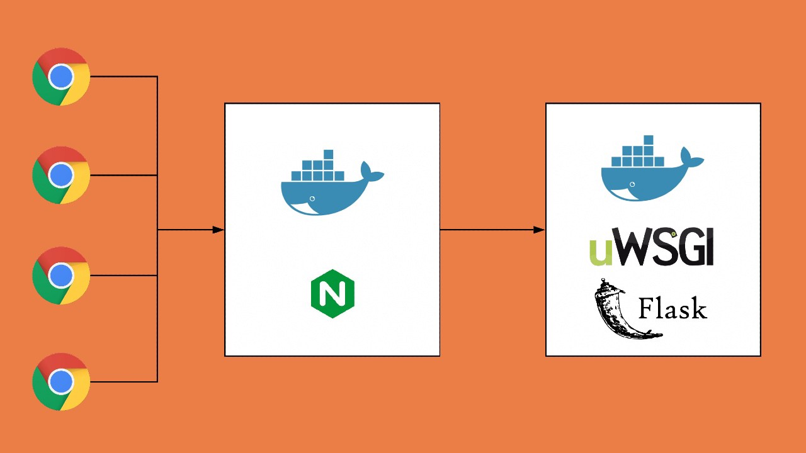

<!--
*** Thanks for checking out the Best-README-Template. If you have a suggestion
*** that would make this better, please fork the repo and create a pull request
*** or simply open an issue with the tag "enhancement".
*** Thanks again! Now go create something AMAZING! :D
***
***
***
*** To avoid retyping too much info. Do a search and replace for the following:
*** github_username, repo_name, twitter_handle, email, project_title, project_description
-->

<!-- PROJECT SHIELDS -->
<!--
*** I'm using markdown "reference style" links for readability.
*** Reference links are enclosed in brackets [ ] instead of parentheses ( ).
*** See the bottom of this document for the declaration of the reference variables
*** for contributors-url, forks-url, etc. This is an optional, concise syntax you may use.
*** https://www.markdownguide.org/basic-syntax/#reference-style-links
-->

[![Contributors][contributors-shield]][contributors-url]
[![Forks][forks-shield]][forks-url]
[![Stargazers][stars-shield]][stars-url]
[![Issues][issues-shield]][issues-url]
[![MIT License][license-shield]][license-url]

<!-- PROJECT LOGO -->
<br />
<p align="center">
  <a href="https://github.com/adrianruizmora/horloge_simplonien">
    
  </a>

  <h3 align="center">Simplonian clock</h3>
  Web app that displays time for simplonians around the world.
  <p align="center">
    
    <br />
    <a href="https://github.com/adrianruizmora/horloge_simplonien"><strong>Explore the docs »</strong></a>
    <br />
    <br />
    <a href="https://github.com/adrianruizmora/horloge_simplonien">View Demo</a>
    ·
    <a href="https://github.com/adrianruizmora/horloge_simplonien/issues">Report Bug</a>
    ·
    <a href="https://github.com/adrianruizmora/horloge_simplonien/issues">Request Feature</a>
  </p>
</p>

<!-- TABLE OF CONTENTS -->
<details open="open">
  <summary><h2 style="display: inline-block">Table of Contents</h2></summary>
  <ol>
    <li>
      <a href="#about-the-project">About The Project</a>
      <ul>
        <li><a href="#built-with">Built With</a></li>
      </ul>
    </li>
    <li>
      <a href="#getting-started">Getting Started</a>
      <ul>
        <li><a href="#prerequisites">Prerequisites</a></li>
        <li><a href="#installation">Installation</a></li>
      </ul>
    </li>
    <li><a href="#usage">Usage</a></li>
    <li><a href="#roadmap">Roadmap</a></li>
    <li><a href="#contributing">Contributing</a></li>
    <li><a href="#license">License</a></li>
    <li><a href="#contact">Contact</a></li>
    <li><a href="#acknowledgements">Acknowledgements</a></li>
  </ol>
</details>

<!-- ABOUT THE PROJECT -->

## About The Project

<div style='display:flex;'>
  
  
</div>

Project goal is to demonstrate simple flask application built with flask, served with nginx, uWSGI and contenerized with docker.

<a href="https://github.com/adrianruizmora/horloge_simplonien">
    
</a>

### Built With

- []()Docker
- []()Ngnix
- []()uWSGI
- []()Flask
- []()swagger
- []()Bootstrap
- []()HTML, Javascript

<!-- GETTING STARTED -->

## Getting Started

To get a local copy up and running follow these simple steps.

### Prerequisites

- Python
  ```sh
  python version 3.6
  ```
- Docker Desktop
  ```sh
  https://docs.docker.com/get-docker/
  ```

### Installation

1. Clone the repo
   ```sh
   git clone https://github.com/adrianruizmora/horloge_simplonien
   ```

### Directory tree

```sh
.
├── LICENSE.txt
├── README.md
├── docker-compose.yml
├── flask
│   ├── Dockerfile
│   ├── __pycache__
│   │   └── run.cpython-38.pyc
│   ├── activate.sh
│   ├── app
│   │   ├── __init__.py
│   │   ├── __pycache__
│   │   │   └── __init__.cpython-38.pyc
│   │   ├── api
│   │   │   ├── __init__.py
│   │   │   ├── __pycache__
│   │   │   │   ├── __init__.cpython-38.pyc
│   │   │   │   ├── fonctions.cpython-38.pyc
│   │   │   │   └── views.cpython-38.pyc
│   │   │   ├── fonctions.py
│   │   │   └── views.py
│   │   ├── static
│   │   │   ├── bootstrap.css
│   │   │   └── main.js
│   │   ├── templates
│   │   │   └── index.html
│   │   └── web
│   │       ├── __init__.py
│   │       ├── __pycache__
│   │       │   ├── __init__.cpython-38.pyc
│   │       │   └── views.cpython-38.pyc
│   │       └── views.py
│   ├── app.ini
│   ├── requirements.txt
│   └── run.py
├── images
│   ├── logo.png
│   └── schema.jpeg
└── nginx
    ├── Dockerfile
    └── nginx.conf

12 directories, 28 files

```

<!-- USAGE EXAMPLES -->

## Usage

1. Build docker image for flask application and nginx using docker-compose.yml on the root directory
   ```sh
   docker-compose build
   ```
2. Create & start the containers
   ```sh
   docker-compose up
   ```
3. If you make any changes to the application rebuild with
   ```sh
   docker-compose up --build
   ```
4. Open up http://localhost/ to see Flask app in action.
5. Open up http://localhost/api/docs to see api documentation generated by swagger

<!-- ROADMAP -->

## Roadmap

See the [open issues](https://github.com/adrianruizmora/horloge_simplonien/issues) for a list of proposed features (and known issues).

<!-- CONTRIBUTING -->

## Contributing

Contributions are what make the open source community such an amazing place to be learn, inspire, and create. Any contributions you make are **greatly appreciated**.

1. Fork the Project
2. Create your Feature Branch (`git checkout -b feature/AmazingFeature`)
3. Commit your Changes (`git commit -m 'Add some AmazingFeature'`)
4. Push to the Branch (`git push origin feature/AmazingFeature`)
5. Open a Pull Request

<!-- LICENSE -->

## License

Distributed under the MIT License. See `LICENSE` for more information.

<!-- CONTACT -->

## Contact

Adrian R

Project Link: [https://github.com/adrianruizmora/horloge_simplonien](https://github.com/adrianruizmora/horloge_simplonien)

<!-- ACKNOWLEDGEMENTS -->

## Acknowledgements

- []()Romain
- []()Maxime
- []()Elodie

<!-- MARKDOWN LINKS & IMAGES -->
<!-- https://www.markdownguide.org/basic-syntax/#reference-style-links -->

[contributors-shield]: https://img.shields.io/github/contributors/adrianruizmora/horloge_simplonien.svg?style=for-the-badge
[contributors-url]: https://github.com/adrianruizmora/horloge_simplonien/graphs/contributors
[forks-shield]: https://img.shields.io/github/forks/adrianruizmora/horloge_simplonien.svg?style=for-the-badge
[forks-url]: https://github.com/adrianruizmora/horloge_simplonien/network/members
[stars-shield]: https://img.shields.io/github/stars/adrianruizmora/horloge_simplonien.svg?style=for-the-badge
[stars-url]: https://github.com/adrianruizmora/horloge_simplonien/stargazers
[issues-shield]: https://img.shields.io/github/issues/adrianruizmora/horloge_simplonien.svg?style=for-the-badge
[issues-url]: https://github.com/adrianruizmora/horloge_simplonien/issues
[license-shield]: https://img.shields.io/github/license/adrianruizmora/horloge_simplonien.svg?style=for-the-badge
[license-url]: https://github.com/adrianruizmora/horloge_simplonien/blob/main/LICENSE.txt
